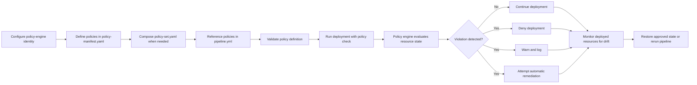

# Policy enforcement in Cloud Deployer Pro

> **Internal documentation note**
>
> Content marked as an internal documentation note is intended for authors and reviewers only. Remove these notes before publication.

## About this guide

This guide serves as the parent document for the policy-enforcement feature in Cloud Deployer Pro. It introduces the feature, explains why it matters, summarizes how policy enforcement fits into the deployment lifecycle, and directs readers to the detailed execution guides that contain the step-by-step procedures.

Use this guide to understand:

- the purpose of policy enforcement;
- the configuration artifacts involved;
- the high-level pre-deployment, deployment, and post-deployment activities;
- the available enforcement responses; and
- the related detailed guides for completing each task.

> **Internal documentation note — remove before publication**
>
> This draft is based on engineering email inputs. Before publication, the technical writer must:
>
> - access the feature in Cloud Deployer Pro;
> - validate the documented workflows and steps;
> - resolve the identified clarification items with engineering and security subject-matter experts; and
> - finalize this overview and the related detailed execution guides.

## Overview

Cloud Deployer Pro policy enforcement adds automated governance checks to the deployment lifecycle. The feature evaluates deployment resources against defined policy requirements before and during deployment, and it can continue monitoring deployed resources for drift afterward.

Policy enforcement supports teams by helping them:

- apply governance rules consistently across environments;
- identify noncompliant configurations before or during deployment;
- separate policy-evaluation permissions from deployment permissions; and
- detect post-deployment drift from the approved state.

The policy engine uses a simplified YAML policy definition that compiles to Rego and runs through Open Policy Agent.

Depending on the configured violation response, the policy engine can:

- deny a deployment;
- issue a warning and log the violation; or
- attempt automatic remediation.

Automatic remediation remains experimental for some resource types.

## How policy enforcement works



The policy-enforcement flow begins with identity and policy configuration, continues through deployment-time evaluation, and extends into post-deployment drift detection.

## Core configuration artifacts

Cloud Deployer Pro uses the following files to define and apply deployment policies:

- *policy-manifest.yaml* defines policy constraints, conditions, required tags, and violation responses.
- *policy-set.yaml* composes several modular policy files into a reusable policy set.
- *pipeline.yml* associates the policy manifest or policy set with a deployment pipeline through the top-level `policies` block.

A policy manifest remains separate from *pipeline.yml*, but *pipeline.yml* references the applicable policy definition.

## Deployment lifecycle and policy enforcement

### Pre-deployment

Complete the following high-level tasks before starting a deployment.

1. Configure the policy-engine identity.

   Configure a separate, granular, read-only IAM role or service account for policy evaluation.

   In Cloud Deployer Pro, the source identifies the configuration location as:

   **Settings > Cloud Integrations > Policy Engine IAM Role**

   The policy-engine identity:

   - can support cross-account or cross-cloud role assumption;
   - must remain separate from the deployment identity; and
   - requires only the permissions needed to evaluate existing resource state.

   See *Configure the policy-engine identity* for detailed instructions.

2. Define policy constraints and violation responses in *policy-manifest.yaml*.

   See *Create and validate a policy manifest* for detailed instructions.

3. Add `conditions` blocks when a policy applies only to a specific environment or application type.

   See *Define policy constraints, conditions, and required tags* for detailed instructions.

4. Define required tags, such as `Owner`, `CostCenter`, and `Environment`.

   See *Define policy constraints, conditions, and required tags* for detailed instructions.

5. Compose modular policy files into *policy-set.yaml* when several policy domains apply.

   See *Compose modular policies into a policy set* for detailed instructions.

6. Reference the policy manifest or policy set from the top-level `policies` block in *pipeline.yml*.

   See *Associate policies with a deployment pipeline* for detailed instructions.

7. Specify the applicable stages and configure stage-specific overrides for development, staging, or production.

   See *Configure policy enforcement by deployment stage* for detailed instructions.

8. Run `cdp policy validate` to validate the policy definition before deployment.

   See *Create and validate a policy manifest* for detailed instructions.

### Deployment

During deployment, Cloud Deployer Pro evaluates the applicable policies against the current resource state.

Run the deployment with policy checks enabled:

```bash
cdp pipeline run --policy-check
```

When the policy engine detects a violation, it applies the response defined in the policy configuration.

#### Enforcement responses

The policy engine can:

- deny the deployment;
- issue a warning and log the violation; or
- attempt automatic remediation for supported resource types.

Automatic remediation remains experimental for some resource types.

Verbose output can include violation details and Rego evaluation traces. Use this information to identify the policy, constraint, or resource state that caused the evaluation result.

See *Run a deployment with policy checks* and *Troubleshoot policy violations* for detailed instructions.

### Post-deployment

After deployment, drift detection compares the deployed resource state with the approved policy state.

Cloud Deployer Pro can receive drift events through supported integrations, including webhooks, Amazon SNS, and Amazon SQS.

Run manual drift detection for a pipeline:

```bash
cdp policy detect-drift --pipeline <id>
```

When Cloud Deployer Pro detects drift, restore the approved state or rerun the pipeline.

#### Drift detection and immutability

Policy immutability helps preserve the policy version used to evaluate and approve a deployment. This supports consistent evaluation and provides a stable reference when investigating post-deployment drift.

See *Detect and resolve policy drift* for detailed instructions.

## Detailed execution guides

The following guides provide the detailed procedures referenced in this overview:

- *Configure the policy-engine identity*
- *Create and validate a policy manifest*
- *Define policy constraints, conditions, and required tags*
- *Compose modular policies into a policy set*
- *Associate policies with a deployment pipeline*
- *Configure policy enforcement by deployment stage*
- *Run a deployment with policy checks*
- *Troubleshoot policy violations*
- *Detect and resolve policy drift*

## Questions for Lena

1. What exact YAML schema and supported values apply to *policy-manifest.yaml*?
2. What exact YAML schema applies to *policy-set.yaml*?
3. What syntax does the top-level `policies` block use in *pipeline.yml*?
4. Which policy types support automatic remediation?
5. What limitations apply to automatic remediation?
6. What exact UI fields appear under **Settings > Cloud Integrations > Policy Engine IAM Role**?
7. Which provider-specific permissions are required for the read-only policy-engine identity?
8. How does cross-account or cross-cloud role assumption work?
9. Which failure messages appear when role assumption or policy evaluation fails?
10. What output does `cdp policy validate` return for successful and failed validation?
11. What output does `cdp pipeline run --policy-check` return for deny, warn, and auto-remediate responses?
12. Is `cdp policy enforc` an incomplete or mistyped command?
13. Which webhook, Amazon SNS, and Amazon SQS configurations are supported for drift events?
14. How are immutable policy versions stored, identified, and retrieved?
15. Which tasks require administrator, security, or developer permissions?
